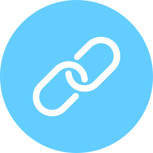

# Shortcut plugin for Craft CMS

Simple URL shortening



## Installation

To install Shortcut, follow these steps:

1. Download & unzip the file and place the `shortcut` directory into your `craft/plugins` directory
4. Install plugin in the Craft Control Panel under Settings > Plugins
5. The plugin folder should be named `shortcut` for Craft to see it.

Shortcut works on Craft 2.4.x and above.

## Shortcut Overview

Let's you create short urls for elements or url's.

## Using Shortcut

To create a short url for a element:
```twig

{{ shortcut.getUrl() }}
```

To create a short url for a url:
```twig

{{ shortcut.getUrl() }}
```

By default, short urls is in the format `xxxx.tld/s/aBC123`. If you want to change the url segment from `s` to something custom, you can add a config file called shortcut.php in craft/config to override it:

```php
<?php
return [
    // Override Shortcut URL segment
    'urlSegment' => 'x',
];
```

If you want to remove the url segment completely and get urls like `xxxx.tld/aBC123`, you can enable the `hideUrlSegment` option.

```php
<?php
return [
    // Hide url segment
    'hideUrlSegment' => true,
];
```

To use a custom domain, add the domain with the `customDomain` option.

```php
<?php
return [
    // Set custom domain
    'customDomain' => 'https://cool.domain',
];
```

Brought to you by [Superbig](https://superbig.co)
